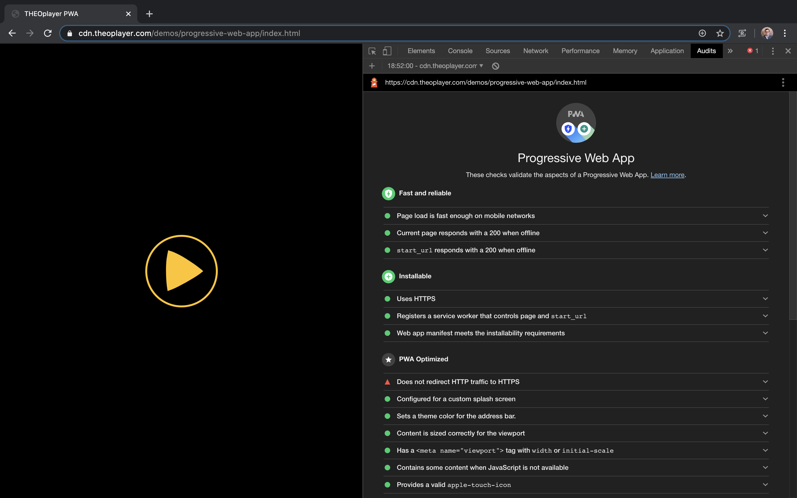

# Info
This project demonstrates how THEOplayer could fit in a progressive web app. The repository at https://github.com/jamesjohnson280/hello-pwa is the starting point for this project.

# Notes
* This application should not be rolled out in production.
* The `/theoplayer/` folder contains the files of the THEOplayer library. Replace these files with your own THEOplayer files if you clone (or download) this project.
* Resources: https://developers.google.com/web/tools/workbox, https://developers.google.com/web/tools, https://web.dev/progressive-web-apps/
* Online demo of this project: https://cdn.theoplayer.com/demos/progressive-web-app/index.html
* This project passed the Lighthouse audit on the 7th of May, 2020.
