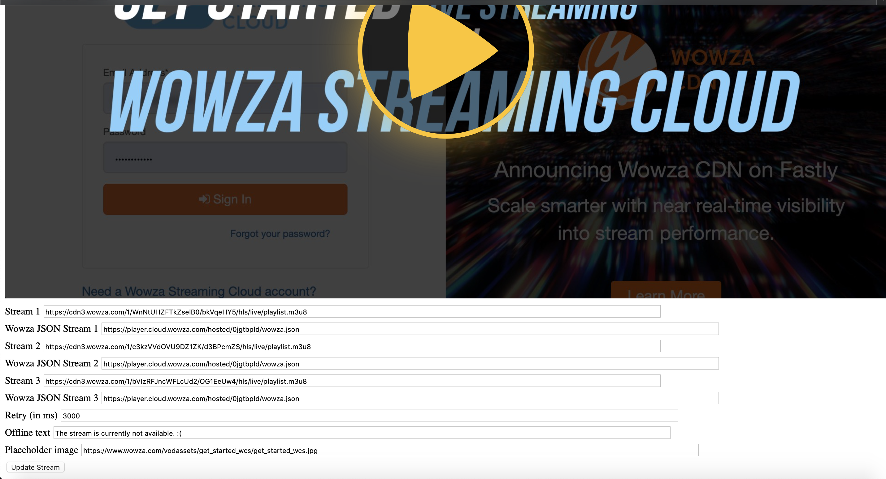
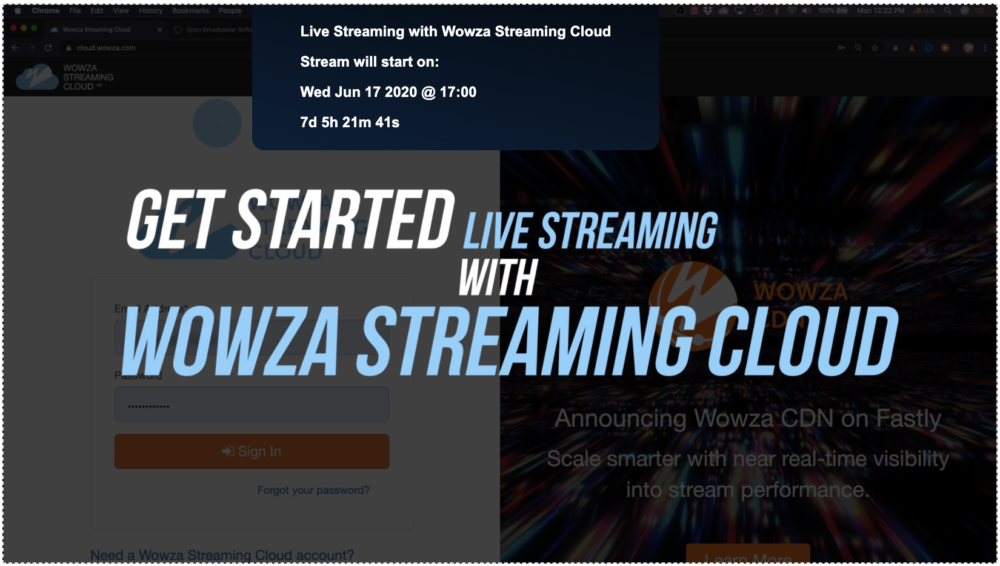
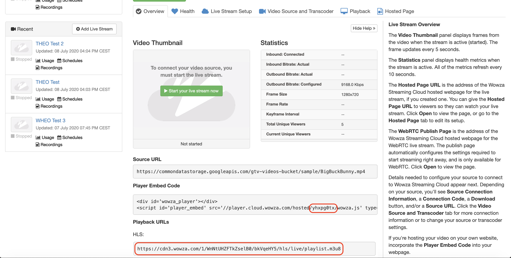

# THEOplayer and Wowza Streaming Cloud
Wowza (Streaming Cloud) and THEOplayer are partners in the streaming industry. When developers use both products,
* [Wowza Streaming Cloud](https://cloud.wowza.com/) is used on the back-end to manage live streams.
* [THEOplayer](https://portal.theoplayer.com/) is used on the client-side to playout the live streams.

Cross-product documentation resources:
* https://www.wowza.com/blog/wowza-streaming-cloud-getting-started
* https://www.theoplayer.com/blog/theoplayer-joins-wowza-media-systems-technology-alliance-partner-program

This reference app demonstrates an integration between THEOplayer and Wowza Streaming Cloud.
 * You can use this project as a starting template for Wowza and THEOplayer playback.
 * You can leverage the `theoplayer-wowza.js` JavaScript library. **This is completely optional.**
 This JavaScript file exposes an API which automatically unlocks a number of features which bridge THEOplayer and Wowza functionalities.

Head over to https://www.wowza.com/blog/wowza-streaming-cloud-getting-started for an introduction to Wowza Streaming Cloud and THEOplayer.

# Features of `theoplayer-wowza.js`
## Livestream information retrieval
When setting a stream, you can supply a Wowza configuration which will be intercepted and processed by `theoplayer-wowza.js`.
If this configuration contains the `jsonUrl`, then the JSON response will automatically be fetched and exposed.

Furthermore,

* THEOplayer overlays the title when the video is paused.
* THEOplayer sets the poster image if no prior poster has been configured.
* THEOplayer leverages this information to enhance the offline-primary-stream-to-online-primary-stream-to-offline-primary-stream-to-online-backup-stream transitions. (See below.) 

## Enhanced offline-to-online-to-offline-to-online-backupstream transitions
The main use-case of Wowza Streaming Engine is to continuously stream live video.

The Lifecycle of Continuous Play using Wowza Streaming Engine with THEOplayer

    1. Add Several Live Streams (START)
    2. Start Each Live Stream
    3. Stop First Live Stream
    4. Verify Next Available Online Stream Starts Automatically
    5. Stop All Streams
    5. Delete All Live Streams (END)
  
  * When you add your live streams, your streams are offline.
  * Before you start your live streams, all your streams remain offline.
  * When you start all your live streams, your first live stream goes online.
  * When you stop your first live stream, your first live stream goes offline and your first online backup live stream remains online and takes over play.
  * When you stop your first backup live stream, a subsequent backup live stream (if specified) remains online and takes over play.
  * When you re-start your first live stream and stop all other live streams, your first live stream goes online and takes over play.
  * When you stop all your live streams, all your streams go offline.
</details>

When you supply a Wowza configuration, the following functionalities are unlocked:

* When all your live streams are offline, THEOplayer displays a placeholder image, which overlaps the video player.
* When your first live stream becomes available, THEOplayer automatically starts playing the stream.
* When your first live stream stops, THEOplayer automatically checks and plays the next available online backup stream.
* When all your backup streams are down but your first live stream is back up, THEOplayer automatically starts playing this stream.



What's shown inside of the placeholder?

* A single, configurable status message.
* A poster image, title and countdown clock -- if the `jsonUrl` is provided.

# Getting started

## 1. THEOplayer HTML5 SDK
Create a THEOplayer HTML5 SDK at https://portal.theoplayer.com/. Get familiar with the THEOplayer API at https://docs.portal.theoplayer.com/getting-started/01-sdks/01-web/00-getting-started.md.

## 2. Create Wowza live streams
Login to your Wowza account and configure several livestreams.

After configuring your livestreams, you will have access to your HLS live streams and your public stream ID's.



In the screenshot above, `https://cdn3.wowza.com/1/WnNtUHZFTkZselB0/bkVqeHY5/hls/live/playlist.m3u8` is the URL of the first HLS live stream, and `yhxpg0tx` is the respective public stream ID.
You can create your public JSON URL by entering the stream ID in the following template: `https://player.cloud.wowza.com/hosted/<stream ID>/wowza.json`.

To specify your backup stream(s), add a new JSON object, for each backup stream, in the `backupStreams` array of your HTML file.

## 3. Configure local demo
First of all, you must run the NPM scripts described below to install your NPM dependencies and to compile the 
previously mentioned `theoplayer-wowza.js`. Finally, you can run an NPM script to boot a local web server.

Once you have all of your library files, you want to swap in your THEOplayer library files in `public/index.html`.
(Head over to the [getting started guide](https://docs.portal.theoplayer.com/getting-started/01-sdks/01-web/00-getting-started.md) if you're unsure on how to achieve this.)

Then, you want to configure your Wowza stream and Wowza configuration in `public/index.html`.
Go through the API for more information on the Wowza configuration.

# Live Demo
A live demo is available at https://cdn.theoplayer.com/demos/wowza/backup-streams-demo/index.html.

# API of `theoplayer-wowza.js`

`THEOplayerWowza`: the global variable which exposes a function to register a video player.
```javascript
var wowzaSession = theoplayerWowza.registerPlayer(player);
```
The `wowzaSession` exposes two functions:
```javascript
wowzaSession.getState(); // returns 'offline' or 'online'
wowza.getStreamData(); // returns the jsonUrl response (e.g. {"title":"Live Streaming with Wowza Streaming Cloud","image":"//prod-railsapp.s3.amazonaws.com/uploads/player/video_poster_image/1153020/get_started_wcs.jpg","live":true,"live_done":false,"countdown":true,"countdown_timestamp":"1592413200","file":"https://cdn3.wowza.com/1/ZTdJRm1BaEJSVFh0/MUpKb0Vy/hls/live/playlist.m3u8","sources":[]})
```
You can use a `WowzaConfiguration` when you have registered your player through `theoplayerWowza.registerPlayer(player)`.
```javascript
    var element = document.querySelector('.theoplayer-container');
    var player = new THEOplayer.Player(element, {
        libraryLocation : '//cdn.theoplayer.com/dash/theoplayer/'
    });

    var wowzaSession = theoplayerWowza.registerPlayer(player);

    function getSourceDescription() {
        //var jsonUrl = document.getElementById('wowzaJson_1').value;
        return {
            sources : [{
                src : document.getElementById('src_1').value,
                type : 'application/x-mpegurl'
            }],
            metadata: {
                wowza: {
                    jsonUrl: document.getElementById('wowzaJson_1').value,
                    retry: document.getElementById('retry').value,
                    offlineText: document.getElementById('offlineText').value,
                    placeholderImageUrl: document.getElementById('placeholderImg').value,
                    queryParametersPassthrough: true,
                    statechangeCallback: console.log,
                    datachangeCallback: console.log,
                    backupStreams: [
                            { sources : [{
                                src : document.getElementById('src_2').value,
                                type : 'application/x-mpegurl'
                                }],
                                metadata: {
                                    wowza: {
                                        jsonUrl: document.getElementById('wowzaJson_2').value,
                                        retry: document.getElementById('retry').value,
                                        offlineText: document.getElementById('offlineText').value,
                                        placeholderImageUrl: document.getElementById('placeholderImg').value,
                                        queryParametersPassthrough: true,
                                        statechangeCallback: console.log,
                                        datachangeCallback: console.log
                                    }
                                }
                            },
                            { sources : [{
                                src : document.getElementById('src_3').value,
                                type : 'application/x-mpegurl'
                                }],
                                metadata: {
                                    wowza: {
                                        jsonUrl: document.getElementById('wowzaJson_3').value,
                                        retry: document.getElementById('retry').value,
                                        offlineText: document.getElementById('offlineText').value,
                                        placeholderImageUrl: document.getElementById('placeholderImg').value,
                                        queryParametersPassthrough: true,
                                        statechangeCallback: console.log,
                                        datachangeCallback: console.log
                                    }
                                }
                            },
                        ]
                    }
                }
        };
    }

    player.source = getSourceDescription();

    document.getElementById('update').addEventListener('click', function() {
        player.source = getSourceDescription();
    })
```

In a `WowzaSourceConfiguration`, you can configure the following flags:

- `jsonUrl`: the JSON URL which returns the Wowza stream information.
- `retry`: the amount of milliseconds which the client should wait to check if the stream is back online.
- `offlineText`: the text which should be shown if the stream is unavailable, and if there's no `jsonUrl`.
- `placeholderImageUrl`: the image which should be shown in the background when there is no `jsonUrl`.
- `queryParametersPassthrough`: setting this value to true appends the query parameters of your HLS master playlist to all other requests (e.g. media playlists, segments, ...).

This feature can be useful when doing [token authentication](https://www.wowza.com/docs/security-features-in-wowza-streaming-cloud#security-features-for-hls-streams-using-wowza-cdn-on-fastly).

- `datachangeCallback`: the function which should be called when the response from `jsonUrl` is available.
- `statechangeCallback`: the function which should be called when a stream either becomes available or unavailable.
- `backupStreams`: an array of your backup live streams, each containing their respective stream source and flag configurations as listed in the main `WowzaSourceConfiguration`.

# NPM scripts
- Install NPM dependencies: `npm install`
- Build `js/theoplayer-wowza.js` with Webpack: `npm run build-dev` or `npn run build`
- Serve the app locally: `npm run start` (Open [http://localhost:8000](http://localhost:8000) to view it in the browser.)

# Future work
* Improve README.md.
* Refactor `/src`.
* Sometimes the HLS master playlist returns a 200 status code (from cache), but the media playlists are still 404s.
When this occurs, the client reloads the stream. While this is not wrong, it can trigger some transitions which could be
considered a visual glitch.